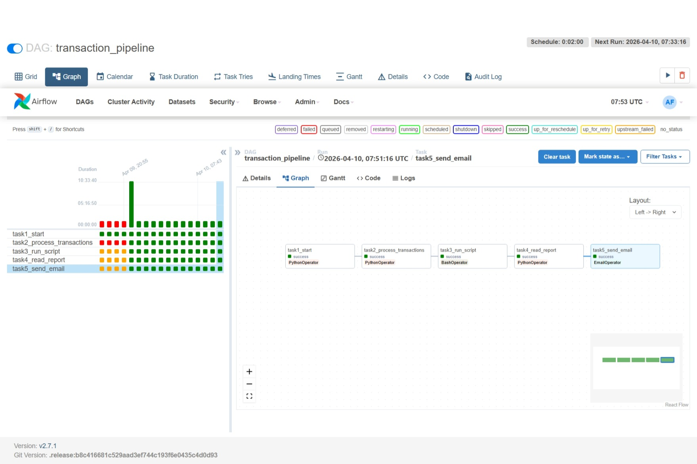
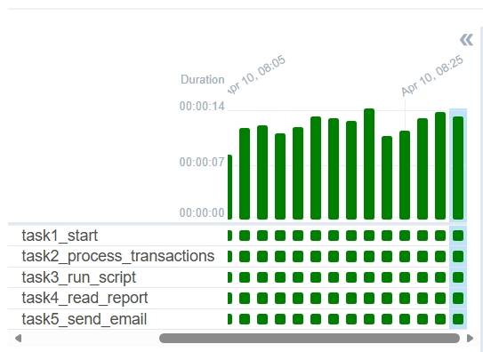

# 🚀 Airflow Transaction Pipeline

## 📌 Description
This project uses Apache Airflow to process transactions and generate a report.

## ⚙️ Tools
- Airflow
- Docker
- Python

## 🔄 Steps
1. Start
2. Process transactions
3. Run script
4. Read report
5. Send email

## 📊 Output
File created:
/data/transactions_report.txt

## 🚀 Run
docker compose -f airflow.yaml up -d
## 📌 Project Description
This project implements an ETL pipeline using Apache Airflow.
It processes transaction data, generates a report, and automates the workflow.
## 🔄 DAG Workflow
1. Start
2. Process transactions
3. Generate report
4. Save output file
# My Project

## Screenshots

## Screenshots

